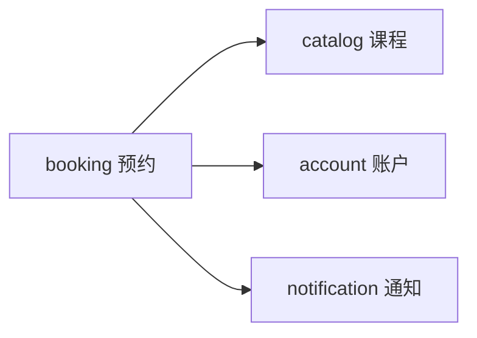

# 阶段 2：领域建模

> 本页模块划分的推导过程（分组判据、余位 / 教练 / 名单的归属裁决）见[从实体到模块划分](../entities-to-modules.md)末尾的完整演示。

## 名词圈选

从用户故事中圈出的候选实体：会员、管理员、课程、教练、排期（某课程在某时段的一次开课）、余位、预约、候补、通知任务。次卡属于 Won't，仅登记不建模。

## 模块划分

| 模块 | 一句话职责 | 拥有的实体 |
| --- | --- | --- |
| account | 管理会员与管理员的注册、登录和身份 | 用户、会话 |
| catalog | 管理课程、教练、排期与余位，守护「余位不为负、不超容量」 | 课程、教练、排期 |
| booking | 管理预约的建立、取消与候补递补，守护「同人同课不重复」 | 预约、候补 |
| notification | 接收通知任务并投递到短信 / 微信渠道 | 通知任务 |

边界备注：「不超订」（US-7）这个不变量由两处共同守护——余位扣减归 catalog（排期与容量是它的实体），防重复预约归 booking。占位动作由 booking 调用 catalog 提供的「占用 / 释放一个名额」操作完成，保证守护点各自单一。

## 模块依赖图

文字描述：booking 依赖 catalog（查询排期、占用与释放名额）、account（引用用户身份）、notification（在事务内登记通知任务）。catalog、account、notification 互不依赖。依赖图无环。

## 用户故事 → 模块映射

| 故事 | 主模块 | 说明 |
| --- | --- | --- |
| US-1 登录注册 | account | |
| US-2 浏览课表 | catalog | |
| US-3 预约 | booking | 经 catalog 占位 |
| US-4 取消 | booking | 经 catalog 释放名额 |
| US-5 管理排期 | catalog | |
| US-6 预约名单 | booking | 预约数据归 booking，由它提供管理端查询 |
| US-7 不超订 | catalog + booking | 见上文边界备注 |
| US-8 候补 | booking | |
| US-9 通知 | notification | 任务由 booking 在事务内产生 |

## 完成标准自查

- [x] 每个用户故事能指出主模块
- [x] 依赖图无环
- [x] 每个模块职责一句话说清，且不变量的守护点明确
